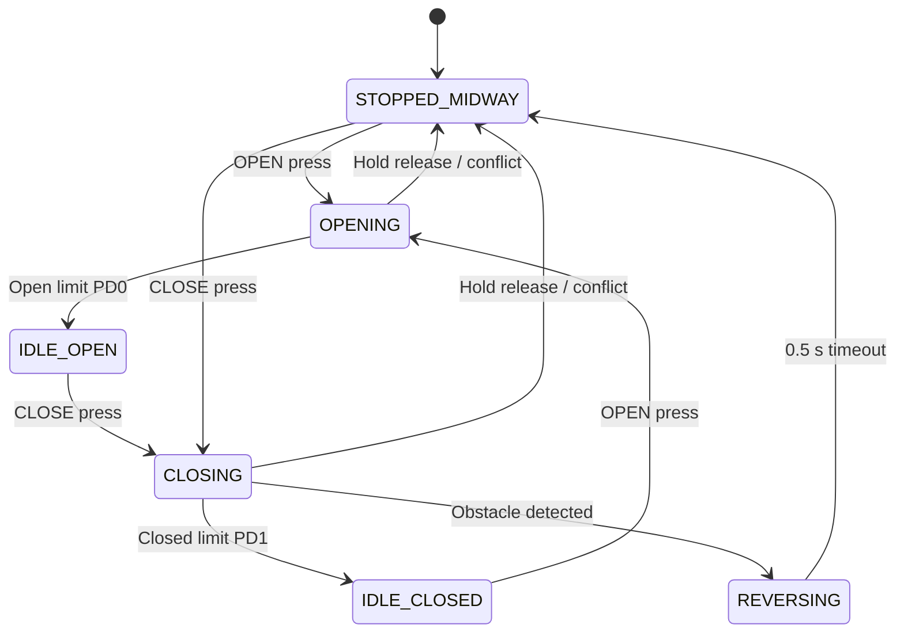

# Smart Parking Gate RTOS

Smart Parking Garage Gate System implemented for the **TM4C123GH6PM Tiva C LaunchPad** using **FreeRTOS**, **Keil uVision**, and the **TExaS ADC/Switch Simulator**.

The project simulates a parking gate controller with driver controls, security controls, limit switches, obstacle detection, task-based scheduling, and a finite state machine.

## Features

- Manual mode: hold button to move, release to stop.
- Auto mode: short press continues motion until the matching limit switch.
- Obstacle protection during closing:
  - stop immediately,
  - reverse for 0.5 seconds,
  - stop midway.
- Security panel priority over driver panel.
- Safe stop on conflicting open/close commands.
- FreeRTOS queue, mutex, and semaphore usage.
- UART debug support for state and event tracing.

## Hardware / Simulator Mapping

| Function | Pin | Simulator Control | Polarity |
|---|---:|---|---|
| Driver OPEN | PF4 | LaunchPadDLL SW1 | Active-low |
| Driver CLOSE | PF0 | LaunchPadDLL SW2 | Active-low |
| Security OPEN | PB0 | TExaS ADC right switch, `PB1-0` mode | Active-high |
| Security CLOSE | PB1 | TExaS ADC left switch, `PB1-0` mode | Active-high |
| Open Limit | PD0 | TExaS ADC right switch, `PD1-0` mode | Active-high |
| Closed Limit | PD1 | TExaS ADC left switch, `PD1-0` mode | Active-high |
| Obstacle ADC | PE2 / AIN1 | TExaS ADC slide pot | Analog |
| Opening / reversing LED | PF3 | Green LED | Output |
| Closing LED | PF1 | Red LED | Output |

> Note: The original project statement lists `PE1 / AIN2` for obstacle input. The provided TExaS simulator project connects the slide pot to `PE2 / AIN1`, so this implementation configures ADC0 Sequencer 3 for channel 1 to match the simulator.

## Software Architecture

The project is split into simple modules:

| File | Responsibility |
|---|---|
| `main.c` | Initializes GPIO, ADC, UART, tasks, and starts the scheduler. |
| `gpio.c/h` | Configures buttons and LEDs, reads inputs, writes motion LEDs. |
| `adc.c/h` | Configures ADC0 SS3 and detects obstacle threshold. |
| `uart.c/h` | UART0 debug output. |
| `tasks.c/h` | FreeRTOS task implementation and RTOS object setup. |
| `fsm.c/h` | Gate finite state machine. |
| `events.h` | Shared event/state enums and event structure. |
| `FreeRTOSConfig.h` | FreeRTOS configuration for this Keil project. |

## FreeRTOS Tasks

| Task | Priority | Purpose |
|---|---:|---|
| Safety Task | Highest | Polls ADC and overrides closing when obstacle is detected. |
| Input Task | High | Reads/debounces buttons, detects short/hold presses, sends events. |
| Gate Control Task | Medium | Owns the FSM and updates shared gate state. |
| LED Task | Medium | Updates PF1/PF3 based on protected gate state. |
| Status Task | Low | Prints UART debug logs for events, states, and obstacle values. |

## Inter-task Communication

- **Queue**: carries button, limit, conflict, obstacle, and timeout events to the FSM.
- **Mutex**: protects the shared gate state read by Safety/LED tasks and written by Gate Control.
- **Binary semaphores**: signal open-limit and closed-limit activations.

## State Machine

FSM states:

- `IDLE_OPEN`
- `IDLE_CLOSED`
- `OPENING`
- `CLOSING`
- `STOPPED_MIDWAY`
- `REVERSING`



## Manual vs Auto Mode

- A press starts motion immediately.
- Release within `300 ms` is treated as auto mode.
- Release after `300 ms` is treated as manual hold release and stops the gate midway.

## Build

Open `project1.uvprojx` in Keil uVision and build `Target 1`.

Last verified build:

```text
Program Size: Code=18696 RO-data=1064 RW-data=8 ZI-data=9184
"Objects/project1.axf" - 0 Error(s), 0 Warning(s).
```

## How To Run In Keil/TExaS

1. Open `project1.uvprojx`.
2. Build the project.
3. Start Debug.
4. Press **F5 / Run**. Do not use step mode for normal testing.
5. Use the TExaS LaunchPadDLL and TExaS ADC windows for inputs.

## Test Cases

| ID | Test | Expected Result | Status |
|---|---|---|---|
| TC-01 | Hold Driver OPEN `SW1/PF4`, then release after >300 ms | Green ON while held, OFF after release | Pass |
| TC-02 | Hold Driver CLOSE `SW2/PF0`, then release after >300 ms | Red ON while held, OFF after release | Pass |
| TC-03 | Manual OPEN/CLOSE from midway | Both directions work from `STOPPED_MIDWAY` | Pass |
| TC-04 | Short OPEN from closed | Green stays ON until `PD0` open limit | Pass |
| TC-05 | Short CLOSE from open | Red stays ON until `PD1` closed limit | Pass |
| TC-06 | Auto OPEN/CLOSE from midway | Auto mode works from `STOPPED_MIDWAY` | Pass |
| TC-07 | Obstacle during auto closing | Red OFF, green ON for 0.5 s, then OFF | Pass |
| TC-08 | Obstacle while holding CLOSE | Safety overrides held close | Pass |
| TC-09 | Obstacle during opening | Obstacle ignored; green stays ON until open limit | Pass |
| TC-10 | Open limit while opening | `PD0` immediately stops green LED | Pass |
| TC-11 | Closed limit while closing | `PD1` immediately stops red LED | Pass |
| TC-12 | Wrong limit during motion | Wrong limit ignored; correct limit stops | Pass |
| TC-13 | Security OPEN overrides Driver CLOSE | Red OFF, green ON | Pass |
| TC-14 | Security CLOSE overrides Driver OPEN | Green OFF, red ON | Pass |
| TC-15 | Driver OPEN + CLOSE conflict | Both LEDs OFF, safe stop | Pass |
| TC-16 | Conflict while moving | Motion stops safely | Pass |
| TC-19 | Rapid queue events | Repeated open/close/limit events are not lost | Pass |
| TC-20 | Shared state mutex | LED and safety behavior remain consistent | Pass |
| TC-21 | Limit semaphores | Open/closed limit signals stop motion immediately | Pass |

## Demo Notes

- Keep ADC slider low except during obstacle tests.
- Use `PB1-0` mode for security buttons.
- Use `PD1-0` mode for limit buttons.
- PB/PD switches in the TExaS ADC window are momentary and auto-release.
- For auto mode, press for about `100-200 ms`.
- For manual mode, hold longer than `300 ms`.

